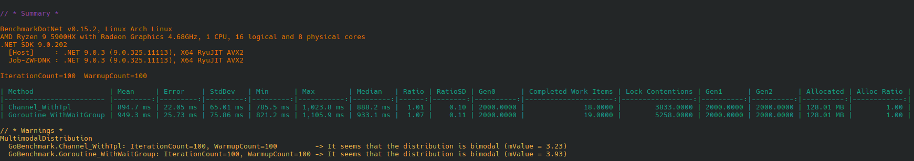

## Concur

A lightweight C# library providing Go-inspired concurrency patterns for .NET applications.

---

## 💾 Installation

[](https://www.nuget.org/packages/Concur/)

Install Concur via the NuGet Package Manager console:

```bash
Install-Package Concur
```

Or using the .NET CLI:

```bash
dotnet add package Concur
```

---

## 🧠 Core Concepts
Concur is built around three fundamental concepts from Go:
- **Goroutine**: A lightweight, concurrent function. In Concur, you create one using the Go() method. It can be a synchronous action or an async task that runs in the background.
- **Channel**: A typed, thread-safe queue that allows goroutines to communicate. One goroutine writes data to the channel, and another reads from it, ensuring safe data transfer without explicit locks.
- **WaitGroup**: A synchronization aid that allows your code to block and wait until a collection of goroutines has finished executing.

---

## 🚀 Getting Started
To get started, add the following using directive. This static import gives you direct access to the Go() method.

```csharp
using static ConcurRoutine;
```

### 1. Running a Goroutine (Go)
The `Go()` method immediately executes a function on a background thread without blocking the caller. 
This is ideal for "fire and forget" operations.

```csharp
// Run a synchronous action concurrently.
Go(() => {
    Console.WriteLine("This is running in the background.");
});

// Run an async lambda concurrently.
// The calling thread is not blocked by the Task.Delay.
Go(async () => {
    Console.WriteLine("Starting async work...");
    await Task.Delay(1000);
    Console.WriteLine("Async work completed after 1 second.");
});

// The main thread continues its execution immediately.
Console.WriteLine("This message appears first!");
```

### 2. Using Channels for Communication
Channels are the best way for goroutines to communicate. The `producer` sends data, and the `consumer` receives it.

#### **Explicit Channel Creation**
For maximum clarity, you can create and manage a channel yourself.

```csharp
// 1. Create a channel that will transport integers.
var channel = new DefaultChannel<int>();

// 2. Start a "producer" goroutine to write data to the channel.
// The 'writer' argument is a reference to the channel.
Go(async writer =>
{
    for (var i = 1; i <= 5; i++)
    {
        Console.WriteLine($"[Producer] Sending: {i}");
        await writer.WriteAsync(i);
        await Task.Delay(100); // Simulate work
    }

    // 3. Close the channel when done. This signals the consumer to stop.
    await writer.CompleteAsync();
}, channel);

// 4. Consume data from the channel on the main thread.
// The loop will automatically end when the channel is completed.
await foreach (var number in channel)
{
    Console.WriteLine($"[Consumer] Received: {number}");
}

Console.WriteLine("Channel consumed. Program finished.");
```

#### **Implicit Channel (Shorthand)**
Concur provides a convenient shorthand that creates and returns a channel for you.

```csharp
// Go<T> creates and returns a readable channel.
// The lambda you provide is the producer.
var numbers = Go<int>(async writer =>
{
    for (var i = 0; i < 5; i++)
    {
        await writer.WriteAsync(i);
        await Task.Delay(100);
    }
    await writer.CompleteAsync(); // The producer must complete the channel.
});

// Consume the values just like before.
await foreach (var number in numbers)
{
    Console.WriteLine($"Received: {number}");
}
```

#### **Bounded Channels**
By default, channels are unbounded. You can specify a capacity to create a bounded channel. A producer writing to a full bounded channel will block asynchronously until a consumer makes space.

```csharp
// Create a channel that can only hold 2 items at a time.
var numbers = Go<int>(async writer =>
{
    for (var i = 0; i < 10; i++)
    {
        Console.WriteLine($"[Producer] Writing {i}...");
        // This will 'block' if the channel has 2 unread items.
        await writer.WriteAsync(i);
        Console.WriteLine($"[Producer] Wrote {i}.");
    }
    await writer.CompleteAsync();
}, capacity: 2); // Set the buffer size

// Consumer
await foreach (var number in numbers)
{
    Console.WriteLine($"[Consumer] Read {number}.");
    await Task.Delay(500); // Simulate slow consumer
}
```

### 2. Synchronizing Goroutines with `WaitGroup`

A `WaitGroup` is used to wait for a group of goroutines to finish. You pass the `WaitGroup` instance to each goroutine you want to track.

```csharp
Console.WriteLine("Starting multiple background jobs...");

var wg = new WaitGroup();
var results = new bool[3];

// Each call to Go(wg, ...) increments the WaitGroup counter.
// The counter is decremented automatically when the goroutine finishes.

Go(wg, async () => {
    await Task.Delay(100);
    results[0] = true;
    Console.WriteLine("Job 1 finished.");
});

Go(wg, async () => {
    await Task.Delay(500);
    results[1] = true;
    Console.WriteLine("Job 2 finished.");
});

Go(wg, async () => {
    await Task.Delay(250);
    results[2] = true;
    Console.WriteLine("Job 3 finished.");
});

// await wg.WaitAsync() blocks until the WaitGroup counter becomes zero.
await wg.WaitAsync();

Console.WriteLine("\nAll background jobs have completed!");
Console.WriteLine($"Results: {results[0]}, {results[1]}, {results[2]}");
```

---

## ⚠️ Error Handling
By default, exceptions thrown inside a goroutine are suppressed and are only logged if the application is in `DEBUG` mode. For production applications, you must configure a global exception handler.

Set the OnException static property early in your application's lifecycle, such as in `Program.cs` or `Startup.cs`.

```csharp
using Microsoft.Extensions.Logging; // Example using a logging framework
using static ConcurRoutine;

// --- In your application startup code ---

// 1. Get your preferred logger instance
var loggerFactory = LoggerFactory.Create(builder => builder.AddConsole());
var logger = loggerFactory.CreateLogger("Concur");

// 2. Assign a handler to the static OnException property
ConcurRoutine.OnException = exception => {
    logger.LogError(exception, "An unhandled exception occurred in a background task.");
};

// Now, any exception in a Go() routine will be routed to your logger.
Go(async () => {
    await Task.Delay(100);
    throw new InvalidOperationException("This will be caught and logged.");
});
```
---

## 🚀 Performance Consideration

`Concur` aims to offer a more expressive, Go-style concurrency API—not to outperform the `Task Parallel Library (TPL)`.

Performance is nearly identical to using `Task.Run` and `Channel<T>` directly. The small overhead from `WaitGroup` is negligible in most cases.

Below is a benchmark comparing `Concur (Go, DefaultChannel, WaitGroup)` with idiomatic C# `(Task.Run, System.Threading.Channels.Channel, Task.WhenAll)`:



---
## 🤝 Contributing
Contributions are welcome! If you'd like to help improve Concur, please feel free to fork the repository, make changes, and submit a pull request.

---

## 📜 License
This project is licensed under the MIT License. See the [LICENSE](./LICENSE) file for details.